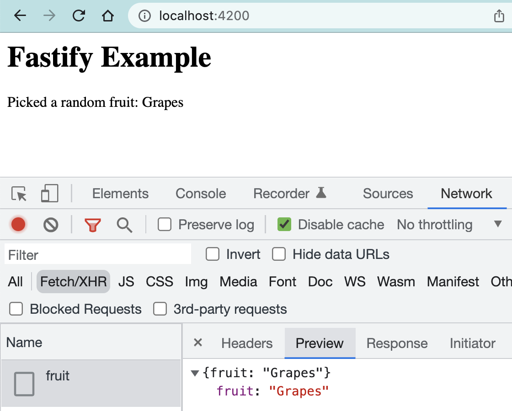

# Fastify example

> Example tiny server with a static folder and a JSON endpoint



## Cypress course

This example application is used for the online course [Cypress Network Testing Exercises](https://cypress.tips/courses)

## Install and use

```
$ npm install
$ npm start
```

Open the `localhost:4200`

## CORS

There is a separate small server for testing browser CORS

```
$ npm run start:cors
# check localhost:6006
```

## Small print

Author: Gleb Bahmutov &lt;gleb.bahmutov@gmail.com&gt; &copy; 2022

- [@bahmutov](https://twitter.com/bahmutov)
- [glebbahmutov.com](https://glebbahmutov.com)
- [blog](https://glebbahmutov.com/blog)
- [videos](https://www.youtube.com/glebbahmutov)
- [presentations](https://slides.com/bahmutov)
- [cypress.tips](https://cypress.tips)
- [Cypress Tips & Tricks Newsletter](https://cypresstips.substack.com/)
- [my Cypress courses](https://cypress.tips/courses)

License: MIT - do anything with the code, but don't blame me if it does not work.

Support: if you find any problems with this module, email / tweet /
[open issue](https://github.com/bahmutov/fastify-example/issues) on Github
